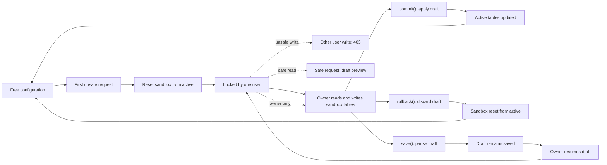
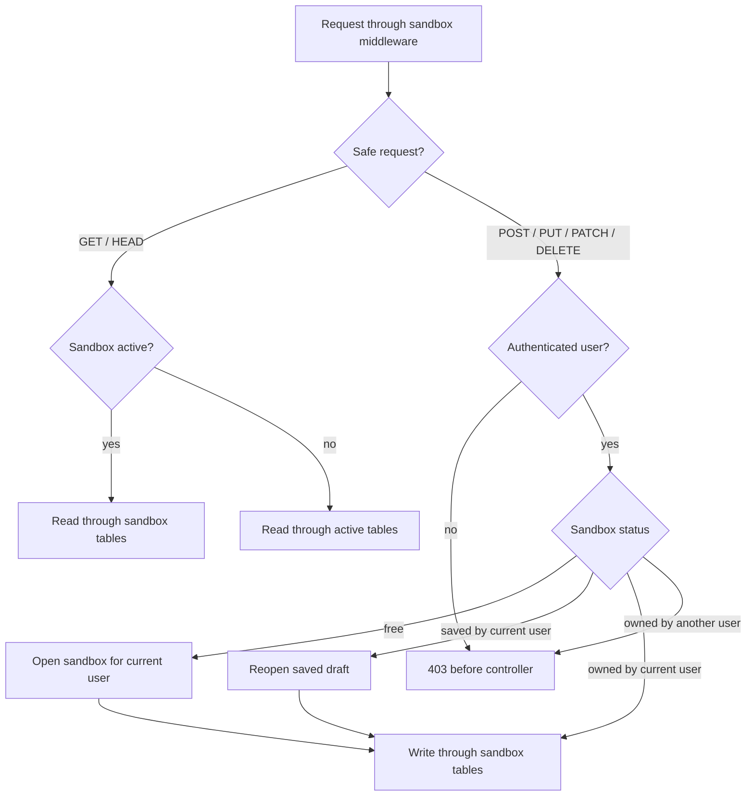
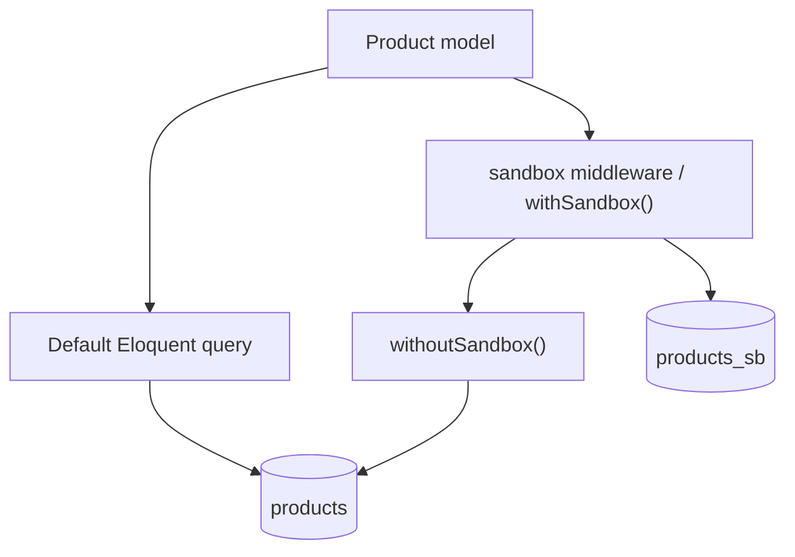
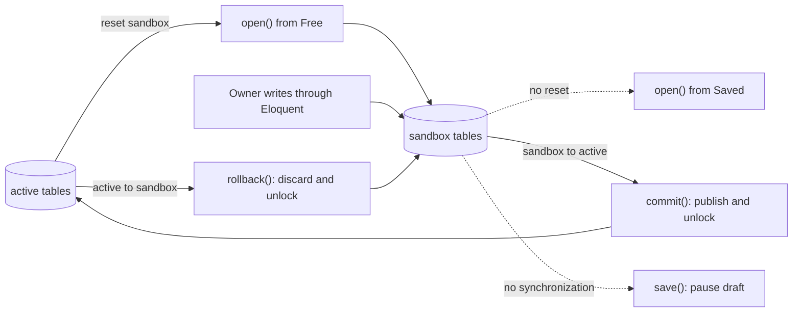

# Sandbox

[](https://github.com/cosmira/sandbox/actions/workflows/code-style.yml)
[](https://github.com/cosmira/sandbox/actions/workflows/phpunit.yml)
[](https://github.com/cosmira/sandbox/actions/workflows/coverage.yml)

**Database-backed drafts for Laravel configuration screens.**

Sandbox lets one user take ownership of a configuration session, edit Eloquent
models through shadow tables, and then explicitly apply, discard, or keep the
draft. It is the workflow you reach for when configuration changes are too
important to be saved straight into production tables.

Think of it as a Git branch for database-backed configuration:

- one user locks the configuration
- writes go to sandbox tables
- everyone can see who owns the draft
- other users cannot mutate the configuration
- the owner chooses `commit()`, `rollback()`, or `save()`



The package is intentionally boring at the database layer. It works through
Eloquent and Laravel's query builder as much as possible, so the same workflow
can run on SQLite, MySQL, PostgreSQL, Oracle, and other supported connections.

## Why

Admin panels often have a dangerous configuration page:

- pricing rules
- category trees
- feature flags
- routing tables
- terms, limits, dictionaries, and other shared reference data

If two people edit it at once, the last write wins. If a half-finished change
is saved directly to active tables, every user sees it immediately. If the
editor closes the tab, nobody knows whether the draft should be applied or
thrown away.

Sandbox gives that screen a clear lifecycle.

```text
free -> reset sandbox -> locked by Alice -> sandbox writes -> commit / rollback / save
```

Opening a free sandbox resets sandbox tables from active tables before the
user starts editing. Reopening a saved draft does not reset the sandbox; the
draft stays intact and simply becomes locked again for editing.

Finishing the session is explicit:

- `commit()` copies sandbox data into active tables and releases the lock
- `rollback()` copies active data back into sandbox tables and releases the lock
- `save()` keeps the draft and marks the sandbox as saved

That rule matches the legacy TM4 configuration lifecycle: a fresh edit starts
from active data, a saved draft can be continued later, and publishing or
discarding the draft is always a deliberate action.

## Installation

```bash
composer require cosmira/sandbox
```

Run the package migrations:

```bash
php artisan migrate
```

Each sandboxed model needs an active table and a sandbox table. By default the
sandbox table is the active table name plus `_sb`.

```text
categories    -> categories_sb
products      -> products_sb
feature_flags -> feature_flags_sb
```

## Quick Start

Add `HasSandbox` to the models that belong to your configuration.

```php
use Cosmira\Sandbox\HasSandbox;
use Illuminate\Database\Eloquent\Model;

class Category extends Model
{
    use HasSandbox;

    protected $table = 'categories';
}
```

Register those models once, usually in an application service provider.

```php
use App\Models\Category;
use App\Models\Product;
use Cosmira\Sandbox\Facades\Sandbox;

Sandbox::models(
    Category::class,
    Product::class,
);
```

Protect your configuration routes with the `sandbox` middleware.

```php
use App\Http\Controllers\DeleteCategoryController;
use App\Http\Controllers\ListCategoryController;
use App\Http\Controllers\StoreCategoryController;
use App\Http\Controllers\UpdateCategoryController;
use Illuminate\Support\Facades\Route;

Route::middleware('sandbox')->group(function (): void {
    Route::get('/categories', ListCategoryController::class);
    Route::post('/categories', StoreCategoryController::class);
    Route::put('/categories/{category}', UpdateCategoryController::class);
    Route::delete('/categories/{category}', DeleteCategoryController::class);
});
```

Keep your controllers ordinary. They still use Eloquent.

```php
Category::query()->create($request->validated());
```

When a `POST`, `PUT`, `PATCH`, or `DELETE` request hits the middleware:

- if the sandbox is free, it is reset from active data and opened
- if the same user saved a draft, it is reopened without resetting data
- if the same user owns the sandbox, registered models switch to sandbox tables
- if another user owns the sandbox, the request receives `403`
- if there is no authenticated user, the request receives `403`

Finish the session explicitly.

```php
use Cosmira\Sandbox\Facades\Sandbox;

Sandbox::me()->commit(note: 'Publish category changes');

// or
Sandbox::me()->rollback(note: 'Discard draft');

// or
Sandbox::me()->save(note: 'Continue tomorrow');
```

## The Configuration Workflow

The package is designed around a single global configuration lock.

1. A user opens the configuration editor.
2. The first unsafe request through `sandbox` opens the sandbox if it is free.
3. Opening from `Free` resets sandbox tables from active tables.
4. Opening from `Saved` keeps the existing draft and locks it again.
5. The status row stores the owner.
6. Registered models switch to sandbox tables during the request.
7. The owner reads and writes the draft through normal Eloquent code.
8. Other users can see that configuration is locked by the owner.
9. Other users cannot send mutating requests to the configuration routes.
10. The owner explicitly commits, rolls back, or saves the draft.

Safe requests can also use sandbox tables. If a sandbox is active, `GET` and
`HEAD` requests through the middleware switch registered models to sandbox
tables for that request. That lets the editor preview the draft while the rest
of the application can decide how much of the active or draft state it should
show.

Middleware only resets request-local model switches after the response. It does
not close the sandbox. That makes the workflow safe for long-running processes
such as Octane and RoadRunner without hiding lifecycle decisions in middleware.

## When The Configuration Is Locked

The sandbox lock is global. Once a user owns it, every request that passes
through the `sandbox` middleware makes a simple decision:



| Request | Owner | What happens |
| --- | --- | --- |
| `GET` / `HEAD` | Any user | Registered models are switched to sandbox tables |
| `POST` / `PUT` / `PATCH` / `DELETE` | Sandbox owner | Allowed; writes go to sandbox tables |
| `POST` / `PUT` / `PATCH` / `DELETE` | Saved draft owner | Draft is reopened for sandbox writes |
| `POST` / `PUT` / `PATCH` / `DELETE` | Another user | The request is rejected with `403` |
| `POST` / `PUT` / `PATCH` / `DELETE` | Guest | The request is rejected with `403` |

That means a locked configuration has two separate concerns:

- reads can show the current draft state for routes protected by `sandbox`
- writes are only accepted from the user that owns the lock

If another user opens a configuration screen while Alice owns the sandbox, the
application should show that Alice is editing. The package stores Alice's user
identifier on the status row. Your application can resolve that identifier to
a display name.

```php
use Cosmira\Sandbox\Facades\Sandbox;

$status = Sandbox::me()->status();

if ($status?->isLocked() && ! $status->isLockedBy(auth()->id())) {
    // Show a read-only screen: "Alice is editing configuration."
}
```

Reads are intentionally not rejected. Configuration screens often need to show
the draft, the lock owner, and disabled controls. If a route must always read
from active tables even while a sandbox is active, use the model helper:

```php
Category::withoutSandbox(function (): void {
    $activeCategories = Category::query()->orderBy('name')->get();
});
```

Writes are different. A non-owner cannot mutate the configuration while the
sandbox is locked.

```php
// Alice owns the sandbox.
// Bob submits POST /categories through the sandbox middleware.
// The middleware returns 403 before the controller writes anything.
```

The lock is released only by an explicit lifecycle decision:

```php
Sandbox::for($ownerId)->commit();   // publish draft and unlock
Sandbox::for($ownerId)->rollback(); // discard draft and unlock
```

`save()` pauses editing. The draft stays in sandbox tables and can be reopened
later by the owner.

```php
Sandbox::for($ownerId)->save(); // keep the draft for later
```

For operational recovery, an administrator can force ownership:

```php
Sandbox::for($adminId)->open(force: true, note: 'Taking over abandoned draft');
```

Use `force: true` deliberately. It is a recovery tool for abandoned or
operator-managed drafts, not the normal collaboration path.

## Lifecycle API

The facade returns a user-scoped builder.

```php
use Cosmira\Sandbox\Facades\Sandbox;

Sandbox::for($userId)->open(note: 'Editing configuration');
Sandbox::for($userId)->commit(note: 'Apply configuration');
```

For the authenticated user:

```php
Sandbox::me()->open();
Sandbox::me()->rollback();
```

Builder methods:

| Method | Description |
| --- | --- |
| `open(force: false, note: null)` | Refreshes and locks a free sandbox, or reopens a saved draft |
| `commit(note: null, asyncUpdater: true)` | Applies sandbox data to active tables |
| `rollback(note: null)` | Resets sandbox data from active tables |
| `save(note: null)` | Keeps the draft and keeps the sandbox active |
| `reset($modelOrClass)` | Refreshes one model or table from active data |
| `apply($modelOrClass)` | Alias for `reset()` |
| `status()` | Returns the current status row |

`force: true` lets an operator take ownership from another user. Use it for
admin recovery flows, not for regular editing.

## Model Registration

`Sandbox::models()` is the canonical place to register configuration models.
Register models in the order they should be synchronized. Reference tables
usually come before dependent tables.

```php
use App\Models\Category;
use App\Models\Product;
use App\Models\Term;
use Cosmira\Sandbox\Facades\Sandbox;

Sandbox::models(
    Category::class,
    Product::class,
    Term::class,
);
```

That one list powers the full workflow:

- middleware switches registered models to sandbox tables
- `commit()` calls `applySandbox()` for registered models
- `rollback()` calls `resetSandbox()` for registered models
- `commit()` and `rollback()` restore switched models to active tables
- `save()` keeps the draft saved in sandbox tables

For rare request-specific cases, listen to `SandboxResolvingModels` and add
extra models dynamically.

```php
use App\Models\TemporaryFlag;
use Cosmira\Sandbox\Events\SandboxResolvingModels;
use Illuminate\Support\Facades\Event;

Event::listen(SandboxResolvingModels::class, function (SandboxResolvingModels $event): void {
    $event->models(TemporaryFlag::class);
});
```

Do not register the same static model list in events. Use `Sandbox::models()`
for that.

## Working With Models

`HasSandbox` gives a model a table pair.



```php
use Cosmira\Sandbox\HasSandbox;
use Illuminate\Database\Eloquent\Model;

class Product extends Model
{
    use HasSandbox;

    protected $table = 'products';
    protected $primaryKey = 'product_id';
}
```

Model options:

| Property | Default | Description |
| --- | --- | --- |
| `$sandboxTablePostfix` | `'_sb'` | Sandbox table suffix |
| `$sandboxPrimaryKey` | model key | Single or composite sync key |
| `$sandboxTrackChangeColumn` | `'change_date'` | Column used to detect changed rows |

Use scopes for explicit one-off reads:

```php
Product::sandbox()->where('enabled', true)->get();
Product::active()->get();
```

Switch the model for a block of normal Eloquent work:

```php
Product::useSandbox();

Product::query()->update(['enabled' => true]);

Product::useActive();
```

If sandbox mode is active but a small block must hit active tables directly,
use `withoutSandbox()`.

```php
Product::withoutSandbox(function (): void {
    Product::query()->whereKey($id)->update([
        'value' => 'written-to-active',
    ]);
});
```

For the opposite case, use `withSandbox()`. Both helpers restore the previous
table state even when the callback throws.

## Synchronization

You can synchronize a model manually.

```php
§
```

The lifecycle methods do this for registered models:



| Operation | Synchronization |
| --- | --- |
| `open()` from `Free` | active -> sandbox |
| `open()` from `Saved` | no synchronization |
| `commit()` | sandbox -> active |
| `rollback()` | active -> sandbox |
| `save()` | no synchronization |

To reset a single sandbox row from active data, pass a model instance.

```php
$product = Product::active()->findOrFail($id);

Sandbox::me()->reset($product);
```

## Status And UI

The package stores one global `SandboxStatus` row.

```php
$status = Sandbox::me()->status();

$status?->isFree();
$status?->isLocked();
$status?->isSaved();
$status?->isForUser($userId);
$status?->isLockedBy($userId);
$status?->toStatusArray();
```

The `status` column is cast to `Cosmira\Sandbox\Enums\SandboxStatus`:

- `SandboxStatus::Free`
- `SandboxStatus::Locked`
- `SandboxStatus::Saved`

A good UI usually has three states:

| State | UI |
| --- | --- |
| Free | Show an edit button |
| Locked by current user | Show apply, rollback, and save draft actions |
| Locked by another user | Disable mutating controls and show the owner |

Sandbox stores the owner identifier, not a user model. Resolve the display name
from your application.

## Events

Lifecycle events are extension points for audit logs, queues, notifications,
and external integrations.

| Event | Data |
| --- | --- |
| `SandboxOpened` | `userId`, `force`, `note` |
| `SandboxResetting` | dispatched before sandbox data should be reset |
| `SandboxCommitting` | dispatched before sandbox data is applied |
| `SandboxCommitted` | `userId`, `committedAt`, `note`, `asyncUpdater` |
| `SandboxRollingBack` | dispatched before sandbox data is rolled back |
| `SandboxRolledBack` | `userId`, `rolledBackAt`, `note` |
| `SandboxSaved` | `userId`, `savedAt`, `note` |
| `SandboxResolvingModels` | request-time model switching |

## Testing

Use `SandboxTestHelpers` in application tests.

```php
use App\Models\Category;
use Cosmira\Sandbox\Testing\SandboxTestHelpers;
use PHPUnit\Framework\Attributes\Test;

class ConfigControllerTest extends TestCase
{
    use SandboxTestHelpers;

    #[Test]
    public function canEditConfiguration(): void
    {
        $this->openSandbox(userId: 1);
        $this->assertSandboxLocked(userId: 1);

        $this->useSandbox(Category::class);

        // Exercise your application code.

        $this->useActive(Category::class);
        $this->commitSandbox(userId: 1);
        $this->assertSandboxFree();
    }
}
```

Available helpers:

- `openSandbox(userId, force, note)`
- `commitSandbox(userId, note, async)`
- `rollbackSandbox(userId, note)`
- `saveSandbox(userId, note)`
- `assertSandboxFree()`
- `assertSandboxLocked(userId)`
- `assertSandboxSaved()`
- `getSandboxStatus()`
- `useSandbox(model)`
- `useActive(model)`
- `applySandbox(model)`

## Quality

The package test suite is intentionally strict:

```bash
composer test
composer test:coverage
composer test:mutation
```

Current targets:

- PHPUnit line, method, and class coverage: `100%`
- Infection MSI: `96%`
- Infection covered MSI: `96%`

`BenchmarkSyncCommand` is excluded from PHPUnit coverage. It is a local
performance tool, not part of the package runtime API.

## Limitations

- Sandbox manages one global configuration session per application.
- Sandbox tables must exist. The package does not create model shadow tables.
- Model table switching is static; middleware and helpers restore request-local
  state for you.
- Jobs and queues do not inherit table switching state. Pass context explicitly
  and switch models inside the job.
- Opening a free sandbox resets sandbox data from active data. Reopening a
  saved draft keeps the saved sandbox data intact.

## License

Sandbox is open-sourced software licensed under the MIT license.
